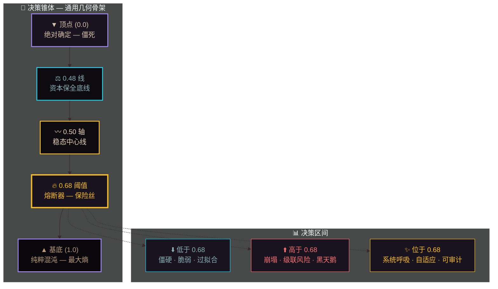
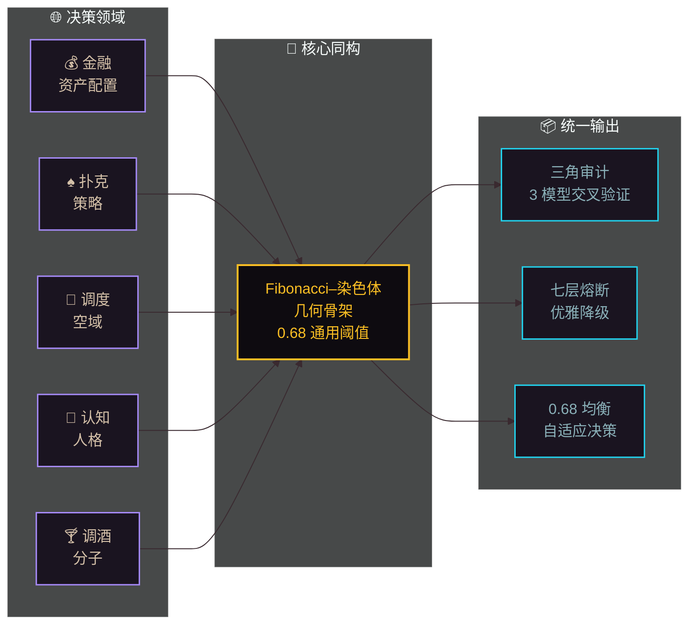

<div align="center">

# 🔺 Game-OS V2.5 — 决策 AI 平台

### 可信决策 AI · 将黑盒 AI 转化为可审计、可解释、带熔断机制的决策管道

[](README-EN.md)
[](README.md)

[](https://github.com/)
[](https://github.com/)
[](LICENSE)

**Live: https://hellomind-star.github.io/ymine/** ·
**Portfolio: https://hellomind-star.github.io/ymine/portfolio.html** ·
**Research: https://hellomind-star.github.io/ymine/research.html**

</div>

---

## ✨ 什么是 Game-OS？

**Game-OS 不是一个游戏 —— 它是一个决策的操作系统。**

从博弈论出发，延伸至量化金融、认知建模、空域调度、分子调酒 —— Game-OS 基于一个核心猜想：

> **每一个决策问题，无论领域如何，都投射到同一个几何骨架上：一个锥体，和一个位于 0.68 的通用风险阈值。**

- **低于阈值** —— 决策僵硬、脆弱、过拟合。
- **高于阈值** —— 决策崩塌、级联风险、黑天鹅。
- **位于阈值** —— 系统呼吸：自适应、可审计、可进化。

64 个完全交互的 HTML 实验室让访客亲手感受数学，而非仅仅阅读它。

---

## 🎯 图 1：决策锥体 · 通用几何骨架



---

## 🧠 核心概念

### 🔺 决策锥体

每一个权衡（探索/利用、风险/回报、秩序/混沌）都栖息在锥体上：

| 位置 | 含义 |
| :--- | :--- |
| **顶点 (0.0)** | 绝对确定 — 僵死 |
| **0.48 线** | 资本保全底线 |
| **0.50 轴** | 稳态中心线 |
| **0.68 阈值** | 保险丝 / 熔断线（源自 φ + 安全边际） |
| **基底 (1.0)** | 纯粹混沌 — 最大熵 |

### 🛡️ 七层熔断机制

风险不是一个单一数字 —— 它是一个分层保险丝系统。当任何一层触发时，系统优雅降级而非级联崩溃。

### 🔺 三角审计

每个决策在可被执行前，都经过三个独立模型的交叉验证 —— 没有任何单一模型拥有不受制约的权威。

### 🌐 跨域同构

Fibonacci–染色体同构（参见 `research.html`）是数学骨架 —— 解释了为何同一个 0.68 常数同时出现在金融、扑克、调度、认知和调酒中。

---

## 🗺️ 图 2：跨域同构映射



---

## 🧪 核心演示

以下为快速入口：

| 演示 | 描述 | 链接 |
| :--- | :--- | :--- |
| 🎯 Cone Game 沙盒 | 实时观察策略收敛至 0.68 均衡 | `labs/evidence/general-game-os.html` |
| 🧬 染色体诊断 | 可视化 Fibonacci–染色体同构 | `labs/evidence/chromosome_diagnostic.html` |
| ♠️♥️ Poker Face Arena ♦️♣️ | 扑克人格竞技场 · MBTI 16 型 AI 陪练 · Kelly+Persona+LLM 三层架构 · WS 实时对战 | [hellomind-star.github.io/poker-egg-fullstack](https://hellomind-star.github.io/poker-egg-fullstack) |
| 📐 CAPM 锥体定价 | 将 CAPM/WACC/DCF 投射到决策锥体 | `labs/evidence/capm-pricing-simulator.html` |
| 🧪 7D 向量分析 | 跨 5 个领域的语义向量空间 | `labs/evidence/vector_analysis.html` |
| 🎰 终极沙盒 | 人类 × 机器 × 市场 — 完整熔断演示 | `labs/evidence/ultimate-sandbox.html` |
| 🎭 PersonaPokerMapper | MBTI→扑克行为映射 · 16 型 × 12 维跨域人格引擎 | `labs/evidence/persona-poker-mapper.html` |
| 📢 营销重构 | 漏斗渗透 & 价值金字塔模拟 | `labs/marketing/` |

---

## 🏗️ 图 3：系统架构

```mermaid
%%{init: {'theme': 'dark', 'themeVariables': {
  'background': '#0a080c',
  'primaryColor': '#A78BFA',
  'primaryBorderColor': '#A78BFA',
  'primaryTextColor': '#d4c0a8',
  'secondaryColor': '#1a1420',
  'tertiaryColor': '#0e0b10',
  'lineColor': '#3a2a30'
}}}%%
graph TB
    subgraph portal["🚪 公共门户"]
        P1["index.html<br>控制台"]
        P2["portfolio.html<br>作者作品集"]
        P3["research.html<br>学术论文"]
    end

    subgraph engines["⚙️ 核心引擎 (原生 JS)"]
        E1["quant-engine<br>量化引擎"]
        E2["cone-game<br>锥体博弈"]
        E3["triangle-audit<br>三角审计"]
        E4["risk-circuit<br>七层熔断"]
    end

    subgraph labs["🧪 64 个交互实验室"]
        L1["Cone Game 沙盒"]
        L2["染色体诊断"]
        L3["CAPM 定价"]
        L4["7D 向量分析"]
        L5["扑克人格映射"]
        L6["+ 59 个更多 …"]
    end

    subgraph backend["🔧 可选后端"]
        B1["FastAPI<br>染色体路由"]
        B2["风暴模拟器"]
        B3["Streamlit 仪表板"]
    end

    P1 --> engines
    engines --> labs
    engines --> backend

    style portal fill:#0a080c,stroke:#A78BFA,stroke-width:1px
    style engines fill:#0a080c,stroke:#FBBF24,stroke-width:1px
    style labs fill:#0a080c,stroke:#22D3EE,stroke-width:1px
    style backend fill:#0a080c,stroke:#8a5a3b,stroke-width:1px
```



---

## 📂 仓库结构

```
ymine/
├── index.html                   # 控制台（主仪表板）
├── portfolio.html               # 作者作品集 / 简历页
├── research.html                # 学术论文落地页
├── ymine-studio.html            # 全功能工作室控制台
├── 404.html                     # 主题 404 页
│
├── assets/
│   ├── css/                     # base.css · components.css · poker-egg.css
│   └── js/                      # bus · components · quant-engine · poker-egg · …
│
├── labs/
│   ├── evidence/                # ★ 核心交互演示 (20+ HTML 实验室)
│   ├── engineering/             # 工程领域模拟
│   ├── structural-mechanics/    # 结构力学实验
│   ├── marketing/               # 营销重构演示
│   └── finance-evidence-lab/    # 金融证据实验室
│
├── engines/                     # 领域引擎 (financemind · airmind · mindspeak · gamemind · …)
├── models/                      # 数据模型 (calc · compute · gamemind · common)
├── game-os-main/                # 核心引擎模块 & 业务模块
├── isomorphism-block-engine/    # 跨域同构块演示
│
├── backend/                     # 可选 FastAPI 后端
├── dashboard/                   # Streamlit 运维仪表板
├── docs/                        # 论文、审计、架构文档、PDF
│   └── Fibonacci-Chromosome_Isomorphism.pdf
├── tests/                       # 核心引擎测试 (浏览器中运行)
├── tools/                       # 内部开发工具
└── video/                       # 视频制作素材
```

---

## 🛠️ 技术栈

| 层级 | 技术 |
| :--- | :--- |
| **前端** | HTML5, CSS3, 原生 JavaScript (ES6+), Canvas 2D, SVG, Web Audio |
| **AI 层** | 凯利公式 · 蒙特卡洛模拟 · 纳什均衡 · PersonaPokerMapper（核心决策不依赖 LLM） |
| **后端（可选）** | Python 3.10+, FastAPI, Uvicorn |
| **仪表板** | Streamlit, Plotly |
| **数学 / 建模** | 解析方法（无需重型 ML 框架） |
| **托管** | GitHub Pages（静态）+ 可选后端部署 |
| **设计** | 暗黑科技美学 · #0a0a18 · #A78BFA · #22D3EE · #FBBF24 |

**设计哲学：** 面向公众的站点零外部依赖 —— 每个实验室一旦缓存即可离线运行。

---

## 📄 研究

Game-OS 背后的数学基础已在以下工作论文中形式化：

**Fibonacci–染色体同构：跨域决策系统的统一几何骨架** — HelloMInd-star, 2026（7 页 IEEE 双栏预印本，即将发表于 arXiv）。

📥 [下载 PDF](docs/Fibonacci-Chromosome_Isomorphism.pdf) ·
📄 [研究页面](research.html)（含摘要、框架、交互实验、BibTeX） ·
arXiv 链接待定

---

## 👤 关于作者

**HelloMInd-star** 在博弈论、认知科学和金融的交汇处构建决策基础设施。

- 🎓 MBA（新加坡）· 金融学本科
- 🎯 2026 AI 产品经理候选人 — 游戏 AI / 创意科技
- 🔺 Game-OS V2.5 架构师 · 跨域同构研究员
- ♠️♥️♦️♣️ Poker Face Arena — 扑克人格竞技场（MBTI 16 型 AI 陪练 · Game-OS V2.5 首个公开 Demo）
- 🍸 Y.MINE "Before the Exit" — MBTI 人格化调酒系统
- 🎵 400h+/月 音乐听众 · 拉丁爵士 + Trap Soul 美学

**核心论点：** 每一个决策领域 —— 从资产配置到扑克到调酒 —— 共享同一个几何骨架。决策锥体和 0.68 通用阈值不是隐喻；它们是可测量、可审计、可利用的。

📁 [作品集](portfolio.html) ·
📄 [研究](research.html) ·
⭐ [GitHub](https://github.com/HelloMind-star)

---

## 🚀 本地运行

```bash
# 使用任意静态服务器
python3 -m http.server 8080
# 然后打开 http://localhost:8080/

# 可选后端（用于染色体 / 风暴端点）
cd backend
pip install -r requirements.txt
uvicorn main:app --reload --port 8000
```

---

## 📝 许可证

MIT — 欢迎 Fork、学习、在此基础上构建。如果本项目对你的研究或产品有帮助，一个 citation 或 star 将不胜感激。

---

<div align="center">
  <sub>🔺 KMP → IPD → 7D Vector → 0.68 Cone · Triangle Audit · Seven-Layer Fuse · Cross-Domain Isomorphism</sub>
  <br>
  <sub>「 每一次决策，都是通往锥体均衡的一步 」</sub>
</div>


---

你可以直接复制这份内容，保存为 `README.md`，替换掉之前的英文版（或并存为中文版）。需要我帮你调整哪张图的配色或内容，随时说。😎
